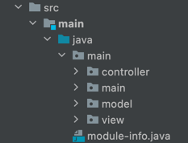

# CSCI 205 - Software Engineering and Design Bucknell University
Lewisburg, PA
### Course Info
Instructor: Professor King\
Semester: Spring 2022
## Team Information: Liv & Gang
Members : Pedro Carneiro Passos, Ramón Asunción, Alvin Huynh, and Olivia Peters

**Scrum Master**\
Pedro Carneiro Passos is currently a Junior majoring in Computer Engineering at\
Bucknell University. Pedro is also getting a minor in Mathematics and Computer\
Science.

**Project Manager**\
Alvin Huynh is currently a Junior majoring in Computer Engineering at Bucknell\
University. Alvin is getting a minor in Management.

**Developer**\
Ramon Asunción is currently a Freshman that is undeclared at Bucknell University. 

**Developer**\
Olivia Peters is currently a Sophomore majoring in Computer Science and Music\
Composition at Bucknell University. 

## Project Information

The project is named WordFX. It takes the game Wordle, which has been going viral\
since the beginning of 2022, and adds more functionalities. If you have never played\
the viral game before, here is a brief explanation of how it works: You get 6 chances\
to guess a random 5-letter word that has been chosen to be the word of the day. As you\
enter your guesses, the letters will change colors. Green indicates the letter in you\
guess is in the same position as the letter in the secret word. If it turns yellow, the\
letter is present in the secret word, but in another position. Lastly, if it turns grey,\
that means the letter is not present in the secret word at all. Use those tips to help you\
guess the secret word!

Similarly, WordFX will give you those tips as well. However, you can play the game as many\
times as you wish. We have implemented a streak functionality, which brings competition for\
players who would like to see how many words they are able to guess in a row. In addition,\
you can choose to play a 3-letter mode, 4-letter mode, or 5-letter mode. Those modes are\
hard, medium, and easy, respectively. Your streak continues to count even if you change modes.

**Challenge your friends and have fun!**

## Package Structure

Using the MVC framework, we split the package structure into four parts.\
Model, View, Controller, and Main. The Model is where all the data structure\
is defined. The view displays the interface to the user (whatever needs to be\
displayed goes here). The Controller handles any kind of events. Lastly, Main is\
where the main JavaFX class is located.

## How to run it

Third-party libraries needed: JavaFX\
Version: 17\
Modules: javafx.graphics, javafx.controls, javafx.fxml\
Reference: https://openjfx.io/

Running the game is very straight forward. After cloning this repo, you just need\
to use gradle simply run it by using the command **-gradle run**!

Choose your mode and _have fun_!

## Video Presentation

_Link_: https://mediaspace.bucknell.edu/media/t/1_3gkknshi
